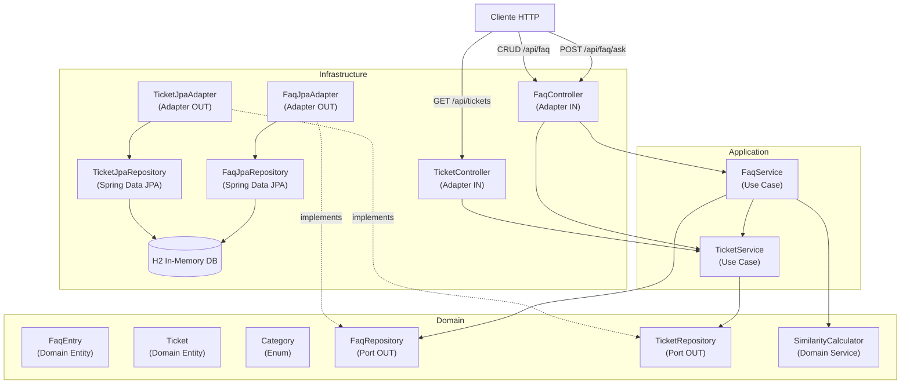
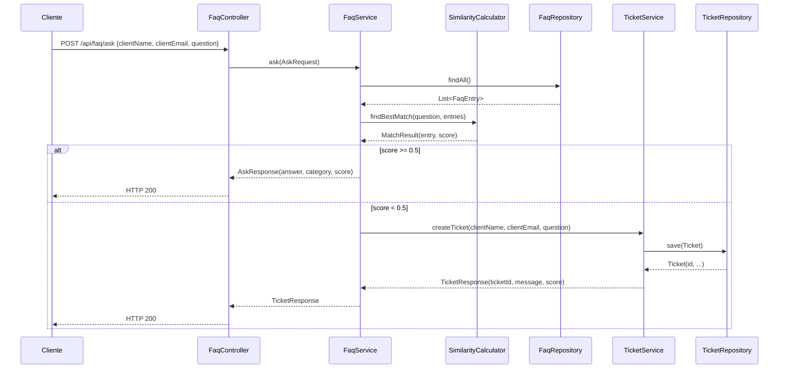

# Design Document — SupportBot FAQ

## Overview

O SupportBot FAQ é um serviço REST construído em Java 17 com Spring Boot que responde perguntas frequentes de clientes sobre prazo de entrega, troca/devolução e pagamentos. O sistema calcula um score de confiança (0.0–1.0) por similaridade textual entre a pergunta recebida e as entradas de FAQ cadastradas. Quando o score está abaixo do limiar de 0.5, um ticket é criado automaticamente para follow-up humano.

A implementação segue a **Arquitetura Hexagonal (Ports & Adapters)**, garantindo que a lógica de negócio seja completamente isolada de frameworks e infraestrutura.

---

## Architecture



### Fluxo principal — `/api/faq/ask`



---

## Components and Interfaces

### Domain Layer

#### Entities

**`FaqEntry`** — entidade de domínio (sem anotações JPA)
```java
public class FaqEntry {
    private Long id;
    private String question;
    private String answer;
    private Category category;
}
```

**`Ticket`** — entidade de domínio
```java
public class Ticket {
    private Long id;
    private String clientName;
    private String clientEmail;
    private String question;
    private LocalDateTime createdAt;
}
```

**`Category`** — enum de domínio
```java
public enum Category {
    DELIVERY, RETURNS, PAYMENTS
}
```

#### Ports (Interfaces)

**`FaqRepository`**
```java
public interface FaqRepository {
    FaqEntry save(FaqEntry entry);
    List<FaqEntry> findAll();
    List<FaqEntry> findByCategory(Category category);
    Optional<FaqEntry> findById(Long id);
    void deleteById(Long id);
    boolean existsById(Long id);
}
```

**`TicketRepository`**
```java
public interface TicketRepository {
    Ticket save(Ticket ticket);
    List<Ticket> findAllOrderByCreatedAtDesc();
    Optional<Ticket> findById(Long id);
}
```

#### Domain Service

**`SimilarityCalculator`** — calcula o Confidence_Score usando similaridade de Jaccard sobre tokens normalizados (lowercase, split por espaço/pontuação). Retorna um `MatchResult` com a melhor `FaqEntry` e o score correspondente.

```java
public class SimilarityCalculator {
    public MatchResult findBestMatch(String question, List<FaqEntry> entries);
    double jaccardSimilarity(String a, String b);
}

public record MatchResult(FaqEntry entry, double score) {}
```

**Decisão de design**: Jaccard sobre tokens foi escolhido por ser determinístico, sem dependências externas e suficiente para o escopo do FAQ. A interface pode ser extraída para um port se algoritmos mais sofisticados forem necessários no futuro.

---

### Application Layer

**`FaqService`**
```java
public class FaqService {
    // Construtor recebe FaqRepository, SimilarityCalculator, TicketService
    public AskResponse ask(AskRequest request);
    public FaqEntryResponse create(CreateFaqRequest request);
    public List<FaqEntryResponse> listAll(Optional<Category> category);
    public void delete(Long id);
}
```

**`TicketService`**
```java
public class TicketService {
    // Construtor recebe TicketRepository
    public TicketResponse createTicket(String clientName, String clientEmail, String question, double score);
    public List<TicketResponse> listAll();
    public TicketResponse findById(Long id);
}
```

---

### Infrastructure Layer

#### JPA Entities (restritas à infraestrutura)

**`FaqEntryJpaEntity`** — `@Entity`, `@Table(name = "faq_entries")`  
**`TicketJpaEntity`** — `@Entity`, `@Table(name = "tickets")`

#### Spring Data Repositories

**`FaqJpaRepository`** — `extends JpaRepository<FaqEntryJpaEntity, Long>`  
**`TicketJpaRepository`** — `extends JpaRepository<TicketJpaEntity, Long>`

#### Adapters

**`FaqJpaAdapter`** — implementa `FaqRepository`, converte entre `FaqEntryJpaEntity` e `FaqEntry`  
**`TicketJpaAdapter`** — implementa `TicketRepository`, converte entre `TicketJpaEntity` e `Ticket`

#### Controllers

**`FaqController`** — `@RestController`, `@RequestMapping("/api/faq")`  
**`TicketController`** — `@RestController`, `@RequestMapping("/api/tickets")`

---

## Data Models

### DTOs (Application ↔ Infrastructure)

```java
// Entrada
record AskRequest(String clientName, String clientEmail, String question) {}
record CreateFaqRequest(String question, String answer, Category category) {}

// Saída — resposta com confiança alta
record AskResponse(String answer, String category, double confidenceScore) {}

// Saída — resposta com ticket aberto
record TicketResponse(Long ticketId, String message, double confidenceScore) {}

// FAQ CRUD
record FaqEntryResponse(Long id, String question, String answer, String category) {}

// Tickets
record TicketListResponse(Long id, String clientName, String clientEmail,
                          String question, LocalDateTime createdAt) {}
```

### Banco de Dados (H2 — schema gerado pelo Hibernate)

**`faq_entries`**

| Coluna     | Tipo         | Restrições        |
|------------|--------------|-------------------|
| id         | BIGINT       | PK, auto-increment|
| question   | VARCHAR(500) | NOT NULL          |
| answer     | VARCHAR(2000)| NOT NULL          |
| category   | VARCHAR(20)  | NOT NULL          |

**`tickets`**

| Coluna       | Tipo         | Restrições        |
|--------------|--------------|-------------------|
| id           | BIGINT       | PK, auto-increment|
| client_name  | VARCHAR(200) | NOT NULL          |
| client_email | VARCHAR(200) | NOT NULL          |
| question     | VARCHAR(500) | NOT NULL          |
| created_at   | TIMESTAMP    | NOT NULL          |

### Configuração (`application.properties`)

```properties
spring.datasource.url=jdbc:h2:mem:supportbotdb
spring.datasource.driver-class-name=org.h2.Driver
spring.jpa.hibernate.ddl-auto=create-drop
spring.h2.console.enabled=true
spring.h2.console.path=/h2-console
```


---

## Correctness Properties

*A property is a characteristic or behavior that should hold true across all valid executions of a system — essentially, a formal statement about what the system should do. Properties serve as the bridge between human-readable specifications and machine-verifiable correctness guarantees.*

### Property 1: Score sempre dentro do intervalo válido

*Para qualquer* par de strings (pergunta recebida e pergunta de FAQ), o Confidence_Score calculado pelo `SimilarityCalculator` deve estar no intervalo fechado [0.0, 1.0]. Para strings idênticas, o score deve ser 1.0.

**Validates: Requirements 1.3**

---

### Property 2: Pergunta idêntica à FAQ_Entry retorna resposta e category corretas

*Para qualquer* `FaqEntry` cadastrada, enviar a pergunta exata dessa entry via `POST /api/faq/ask` deve retornar uma resposta com `confidenceScore >= 0.5`, `answer` igual ao `answer` da entry e `category` igual à `category` da entry.

**Validates: Requirements 1.2, 1.4**

---

### Property 3: Requisição inválida sempre retorna HTTP 400

*Para qualquer* requisição `POST /api/faq/ask` com campos obrigatórios ausentes (`clientName`, `clientEmail` ou `question`) ou com `question` composta apenas de whitespace, o sistema deve retornar HTTP 400.

**Validates: Requirements 1.5, 1.6**

---

### Property 4: Ticket criado preserva dados do cliente

*Para qualquer* requisição `POST /api/faq/ask` que resulte em `confidenceScore < 0.5`, o ticket criado deve conter exatamente os mesmos `clientName`, `clientEmail` e `question` da requisição original, e a resposta HTTP deve conter `ticketId`, `message` e `confidenceScore`.

**Validates: Requirements 2.1, 2.2**

---

### Property 5: Round-trip de criação de FAQ_Entry

*Para qualquer* `CreateFaqRequest` válido (question, answer e category não-nulos), após `POST /api/faq`, a entry retornada deve conter os mesmos `question`, `answer` e `category` enviados, além de um `id` gerado não-nulo. A entry deve aparecer na listagem de `GET /api/faq`.

**Validates: Requirements 3.1, 3.2**

---

### Property 6: Filtro por category retorna apenas entries da category solicitada

*Para qualquer* category válida (`DELIVERY`, `RETURNS`, `PAYMENTS`) e qualquer conjunto de FAQ_Entries cadastradas, `GET /api/faq?category={category}` deve retornar apenas entries cuja `category` seja igual ao filtro aplicado.

**Validates: Requirements 3.3**

---

### Property 7: Delete remove a entry e torna id inexistente

*Para qualquer* `FaqEntry` existente, após `DELETE /api/faq/{id}` retornar HTTP 204, a entry não deve mais aparecer em `GET /api/faq`. Para qualquer `id` que não existe, `DELETE /api/faq/{id}` deve retornar HTTP 404.

**Validates: Requirements 3.4, 3.5**

---

### Property 8: Listagem de tickets está ordenada por createdAt decrescente

*Para qualquer* conjunto de tickets criados em momentos distintos, `GET /api/tickets` deve retornar a lista com os tickets ordenados por `createdAt` em ordem decrescente (mais recente primeiro).

**Validates: Requirements 4.1**

---

### Property 9: Round-trip de busca de ticket por id

*Para qualquer* ticket criado pelo sistema, `GET /api/tickets/{id}` deve retornar HTTP 200 com os mesmos dados (`clientName`, `clientEmail`, `question`, `createdAt`) do ticket original. Para qualquer `id` que não existe, deve retornar HTTP 404.

**Validates: Requirements 4.2, 4.3**

---

## Error Handling

| Situação | HTTP Status | Resposta |
|---|---|---|
| Campos obrigatórios ausentes no body | 400 | `{"error": "Campo X é obrigatório"}` |
| `question` vazia ou só whitespace | 400 | `{"error": "O campo question não pode ser vazio"}` |
| `category` inválida no cadastro de FAQ | 400 | `{"error": "Category inválida. Valores aceitos: DELIVERY, RETURNS, PAYMENTS"}` |
| FAQ_Entry não encontrada por id | 404 | `{"error": "FAQ entry não encontrada com id: X"}` |
| Ticket não encontrado por id | 404 | `{"error": "Ticket não encontrado com id: X"}` |
| Falha na persistência do ticket | 500 | `{"error": "Erro interno ao persistir o ticket"}` |

Tratamento centralizado via `@ControllerAdvice` (`GlobalExceptionHandler`) na camada de infraestrutura. Exceções de domínio (`FaqEntryNotFoundException`, `TicketNotFoundException`) são lançadas na camada de aplicação e mapeadas para os status HTTP corretos no handler.

---

## Testing Strategy

### Abordagem Dual

A estratégia combina testes de unidade (exemplos concretos e casos de borda) com testes baseados em propriedades (cobertura universal de entradas).

### Testes de Unidade

Focados em:
- Comportamento específico do `SimilarityCalculator` com exemplos concretos
- Mapeamento de exceções para status HTTP no `GlobalExceptionHandler`
- Conversão entre entidades JPA e entidades de domínio nos adaptadores
- Casos de borda: lista de FAQ vazia, pergunta com caracteres especiais

### Testes Baseados em Propriedades

**Biblioteca**: [jqwik](https://jqwik.net/) (property-based testing para Java/JUnit 5)

Cada propriedade do design deve ser implementada como um teste `@Property` com mínimo de **100 iterações**.

Tag de referência obrigatória em cada teste:
```
// Feature: supportbot-faq, Property N: <texto da propriedade>
```

**Mapeamento de propriedades para testes:**

| Propriedade | Tipo de Teste | Geradores |
|---|---|---|
| P1 — Score em [0.0, 1.0] | `@Property` em `SimilarityCalculatorTest` | `@ForAll String` arbitrário |
| P2 — Pergunta idêntica retorna match correto | `@Property` em `FaqServiceTest` | `@ForAll FaqEntry` gerado |
| P3 — Requisição inválida → HTTP 400 | `@Property` em `FaqControllerTest` | Gerar requests com campos nulos/whitespace |
| P4 — Ticket preserva dados do cliente | `@Property` em `FaqServiceTest` | `@ForAll AskRequest` com score < 0.5 |
| P5 — Round-trip criação de FAQ | `@Property` em `FaqServiceTest` | `@ForAll CreateFaqRequest` válido |
| P6 — Filtro por category | `@Property` em `FaqServiceTest` | `@ForAll Category`, `@ForAll List<FaqEntry>` |
| P7 — Delete remove entry | `@Property` em `FaqServiceTest` | `@ForAll FaqEntry` existente |
| P8 — Ordenação de tickets | `@Property` em `TicketServiceTest` | `@ForAll List<Ticket>` com timestamps distintos |
| P9 — Round-trip busca de ticket | `@Property` em `TicketServiceTest` | `@ForAll Ticket` criado |

### Testes de Integração

- Subir contexto Spring com H2 em memória (`@SpringBootTest`)
- Testar fluxo completo de `POST /api/faq/ask` → criação de ticket
- Testar CRUD completo de FAQ entries via `MockMvc`
- 1–3 exemplos representativos por fluxo

### Testes de Smoke

- Verificar que a aplicação sobe com H2 (`@SpringBootTest`)
- Verificar que as tabelas `faq_entries` e `tickets` são criadas
